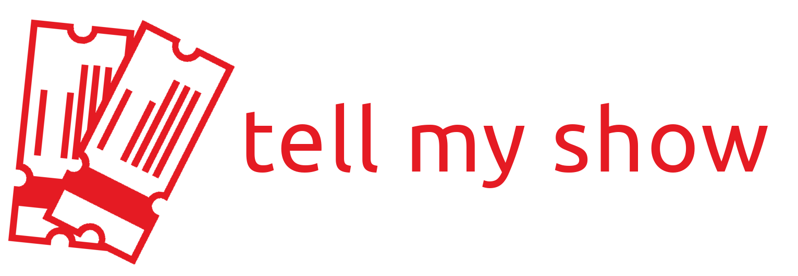

# TellMyShow - BookMyShow Ticket Notifier Telegram Bot



Live Bot : [@TellMyShow_bot](https://t.me/TellMyShow_bot)

## Available Commands
- <strong>/wl</strong> - Get your waiting list
- <strong>/list_locations</strong> - List all available locations
- <strong>/list_venues <location_code> </strong>- List all available venues with venue code at given location
- <strong>/enroll <movie_code> <venue_code> <date_string> </strong>- Enroll for notification for given movie at given venue on given date
    - Example Usage: /enroll ET00310790 PVKC 22-04-2021
    - Venue Code can be obtained using above list venues command
    - Movie Code is present in the URL of the movie's page on in.bookmyshow.com.
    - Sample URL with movie code at end: https://in.bookmyshow.com/kochi/movies/spider-man-no-way-home/ET00310790

## Setup your own

- Ensure Rust is installed [Link](https://www.rust-lang.org/tools/install)
- Get token from [@BotFather](https://telegram.me/BotFather)
- `
sudo apt install build-essential pkg-config libssl-dev libsqlite3-dev jq
`
```bash
export TELOXIDE_TOKEN=<Token from BotFather>
source update_play_store_version.sh # Or manually : export BMS_APP_VERSION=9.7.0
cargo run --release
```